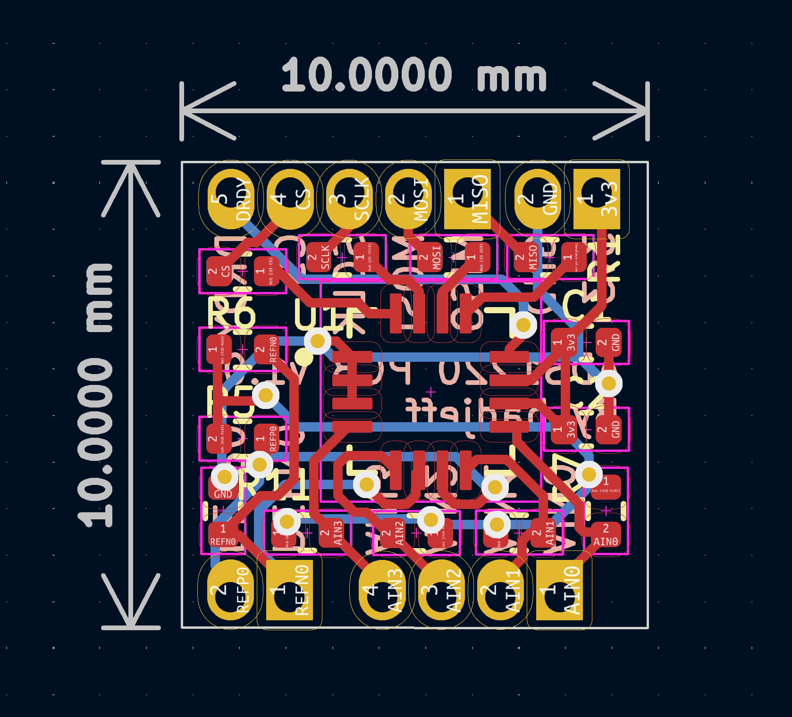
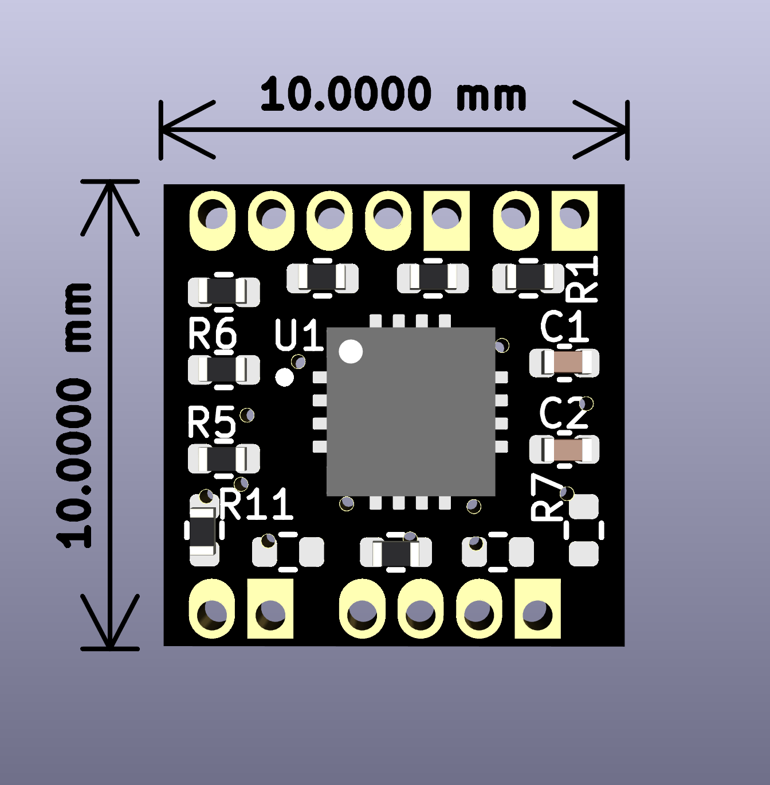
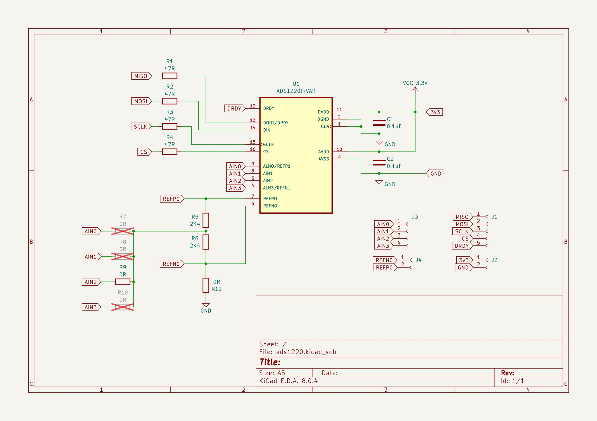

# ADS1220 PCB

[Texas Instruments ADS1220](https://www.ti.com/product/ADS1220) ADC sensor breakout board.

- Designed for measuring wheatstone bridge circuit on Lenovo ThinkPad T440 series trackpoint sensor.
- Be operated with 3.3V voltage level ONLY.
- Unipolar Analog Power Supply ONLY.
- Outlined as small as possible for bottom mount on low profile keyboards.

## PCB

Online preview avaliable [here](https://kicanvas.org/?github=https%3A%2F%2Fgithub.com%2Fbadjeff%2Fads1220-pcb), powered by [KiCanvas](https://github.com/theacodes/kicanvas).

*Figure 2: PCB edgecuts dimension*

*Figure 3: PCB 3D View - 1.0mm FR4*

*Figure 4: Schematic*

### BOM

|Designator|Footprint|Quantity|Value|LCSC Part #|
|-|-|-|-|-|
|C1,C2|SMD 0402|2|100nF|C1525|
|R1,R2,R3,R4|SMD 0402|4|47R|C137973|
|R5,R6|SMD 0402|2|2K4 (for V+ Ref)|C112296|
|R7|SMD 0402|1|0R (for V- Ref)|C106231|
|U1|ADS1220IRVAR|1|VQFN-16-EP(3.5x3.5)|C2651338|
|J1|1.27mm Pin header|1|1x5|-|
|J2,J4|1.27mm Pin header|2|1x2|-|
|J3|1.27mm Pin header|1|1x4|-

- SMD 0402 (Imperial) aka 1005 Metric.

### Board Characteristics

- Copper layer count: 2
- Board thickness: 1.0 mm
- Board overall dimensions: 10.0 x 10.0 mm

## License

Available under the [CERN-OHL-P v2](/LICENSE) permissive license.
